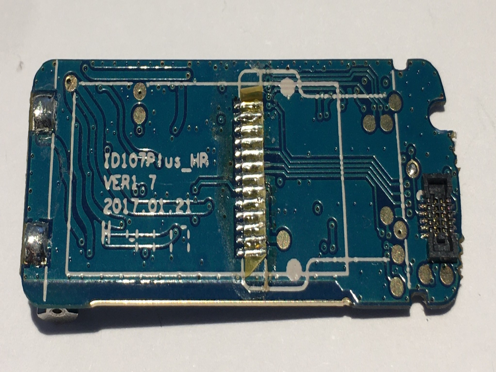
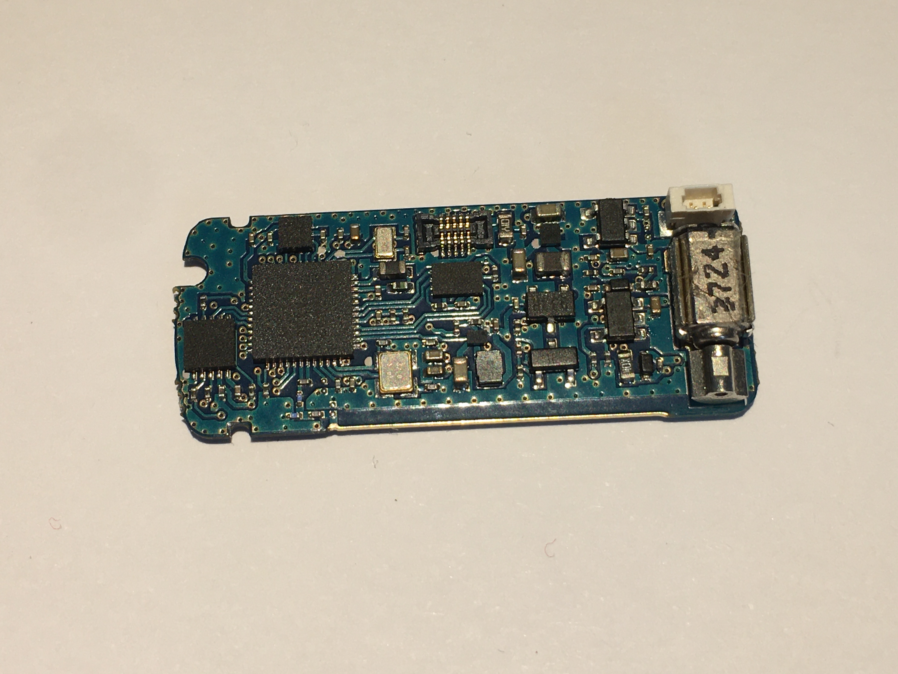
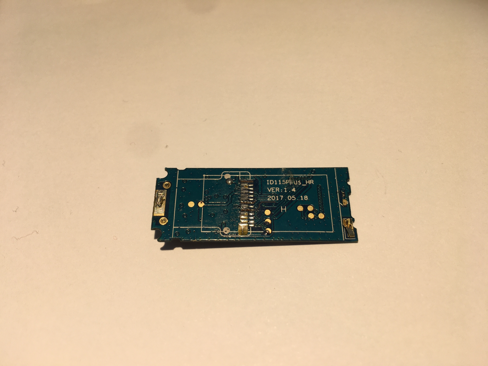
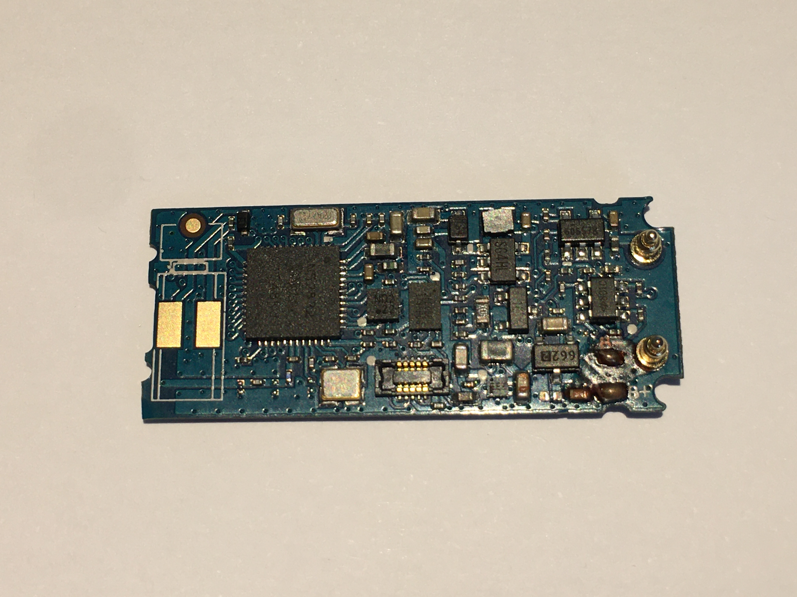
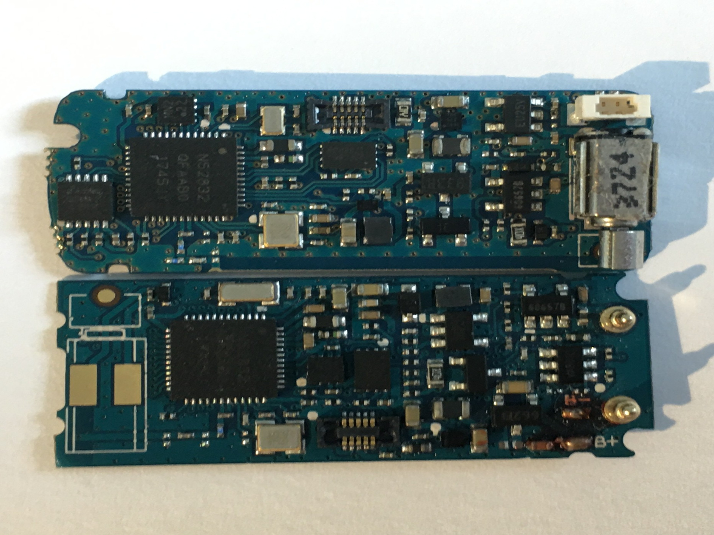

# ID107+HR/ID115+HR
The internals of both devices are very similar and share a lot of hardware.  

SWD programming test points can be found on the back of both PCBs
- [ ] TODO: PCB pictures and SWD pinout
## ID107+HR
| Component | Datasheet |
|-|-|
| NRF52832 SOC | [Link](https://infocenter.nordicsemi.com/pdf/nRF52832_PS_v1.0.pdf) |
| BMA222 Accelerometer | [Link](http://dl.btc.pl/kamami_wa/bma222.pdf) |
| PARAGON 25F08 8MBit Flash | [Link](http://j5d2v7d7.stackpathcdn.com/wp-content/uploads/2018/12/PN25F08-datasheet.pdf) |

## ID115+HR
| Component | Datasheet |
|-|-|
| NRF52832 SOC | [Link](https://infocenter.nordicsemi.com/pdf/nRF52832_PS_v1.0.pdf) |
| BMA222 Accelerometer | [Link](http://dl.btc.pl/kamami_wa/bma222.pdf) |
| PARAGON 25F08 8MBit Flash | [Link](http://j5d2v7d7.stackpathcdn.com/wp-content/uploads/2018/12/PN25F08-datasheet.pdf) |

## PCB Photos

