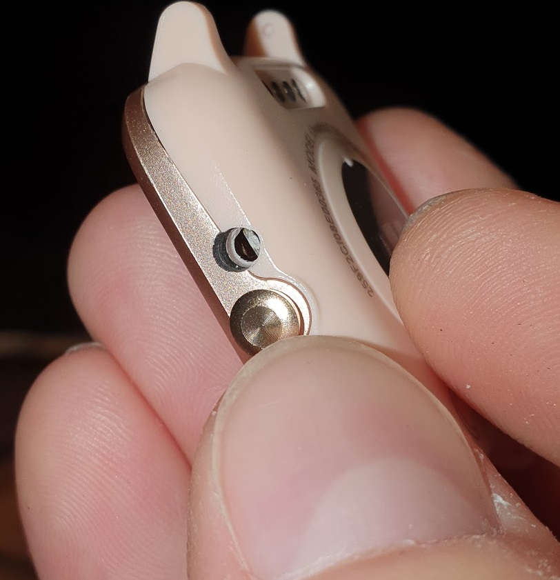

[<- Nordic Semiconductor](.)

# ID205L
ID205L smartwatch

## Hardware

| Component | Datasheet |
|-|-|
| nRF52840 SOC |  |

## Vendors

| Vendor | Price | URL |
|-|-:|-|
| AliExpress - Yuho Store | 25.39 | [https://de.aliexpress.com/item/4000560486681.html](https://de.aliexpress.com/item/4000560486681.html) |

___
## General Information
The watch is not reflashable without taking it apart as the Bootlaoder uses a signing key that is not available.

There are 2 methods to open and reflash it.

-1. Like in kvasdopil's repo describped by taking avaw the frame and then the fron glass.

-2. Drilling a small hole at the exact point where the SWD port is and puting acupuncture needels inside to CLK and SWD.

___
## Development Effort
### [Kvasdopil / Espruino](https://github.com/kvasdopil/id205l) 
- Many infos about the Hardware available, how to open and pinout.
